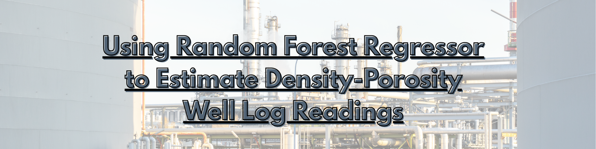

# Title 

In this project, I delve into the two worlds of petroleum engineering and machine learning. I want to explore and evaluate if data-driven decision could be useful in real-world data.

## Throughout the project, I simultaneously learn about ;

  ## Petroleum Engineering :
  -  The usage behind the logs and which log tool to use.
  -  How to properly associate data dropping with the well log fundamentals.
  -  The dynamic environment of the wellbore.
  -  Why is the time of the data taken is actually matters.
  
  ## Data Science :
  - Why multicollinearity is bad for tree-based algorithm and how to fix it.
  - Using data preprocessing and attempts on dataframe manipulation.
  
  ## Machine Learning :
  - How to properly splitting the data.
  - Using cross-validation to underpin the estimator's emphasis an automate hypertuning.
  - How to evaluate and optimize the estimator's performance

## Syntax, Libraries and APIs
  - **Python** : 3.14.7
  - **Data Science** : Numpy, Pandas, Maplotlib, Seaborn
  - **Machine Learning** : Scikit-learn
  - **APIs**: None

## Disclaimer :
The dataset disclaimer has been stated in the [Project Introduction](Project%201%20-%20Rand.Forest%20on%20Density-Porosity%20Log/Project_Introduction.ipynb). All Rights Reserved.
  

